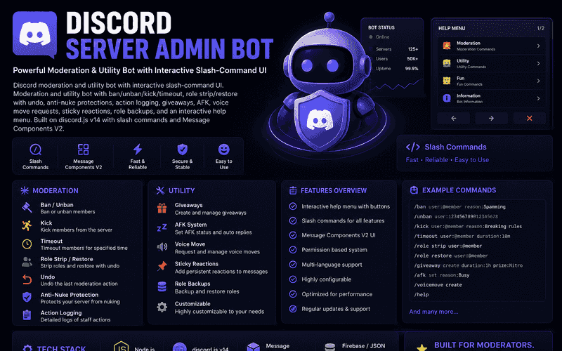
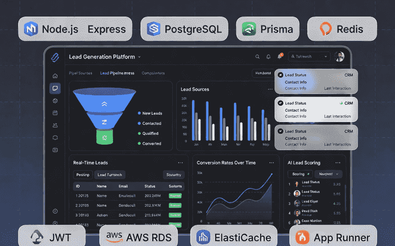
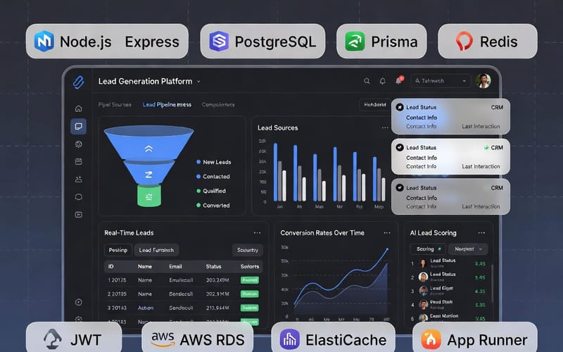
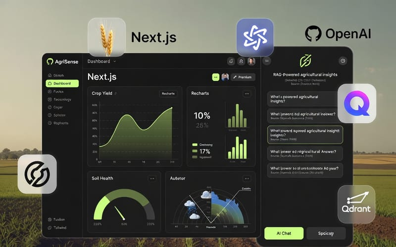
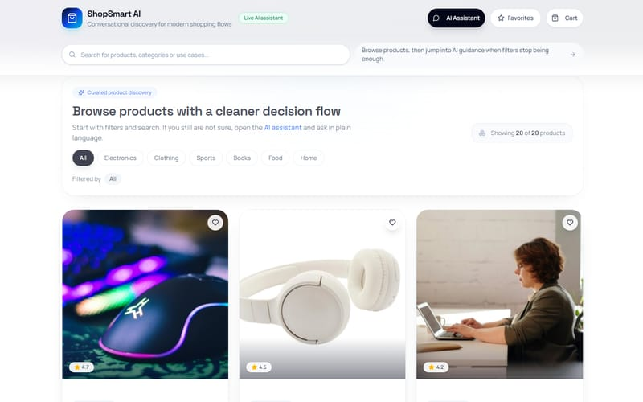
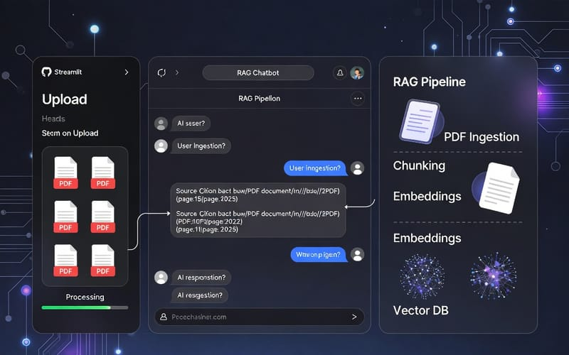
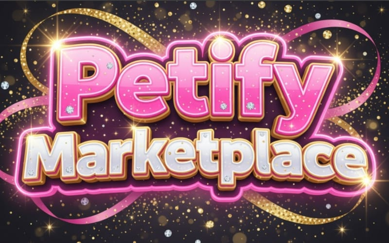
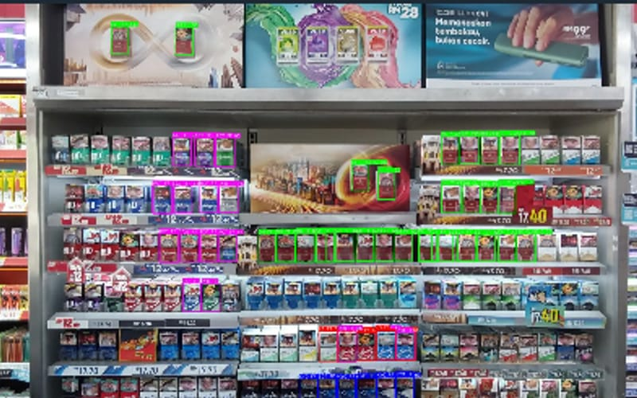
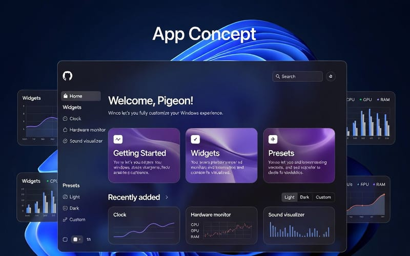

<!-- Header -->

  

  

  
  
  
  

  
  
  

---

##  About me

I'm a **Senior Full Stack Software Engineer** working where product engineering meets automation.
My title says full stack. In practice, I'm the engineer teams bring in when a system has to **run 24/7, respond in milliseconds, and hold up against real users trying to break it.**

-  **Bot engineering:** moderation-grade Discord bots, AI-powered Telegram agents, browser automation at scale
-  **AI systems:** LangChain and LangGraph agents, RAG pipelines on vector databases, token-optimized LLM workflows
-  **Production platforms:** React and Next.js frontends, Node.js and Python backends, PostgreSQL, Redis, AWS
-  **Networking and low-level:** proxies, proxy-aware sessions, Go and Rust for performance-critical paths
-  **Desktop and mobile:** WinUI 3, VB.NET and Python hybrids, React Native

> Clean architecture, performance first, and code that stays maintainable after launch.

 

---

##  Bots are my specialty

  

A bot looks simple from the outside. The real work is what users never see: **rate limits, permissions, race conditions, abuse, restarts, and state that can never be lost.** That is where I do my best work.

<table>
  <tr>
    <td width="33%" valign="top">
      <h3> Discord Admin Bot</h3>
      <code>discord.js v14</code> <code>Slash Commands</code> <code>Components V2</code>
        
      Full moderation suite: ban, kick and timeout, <b>role strip and restore with undo</b>, <b>anti-nuke protection</b>, action logging, role backups, giveaways, AFK, voice move requests, sticky reactions and an interactive help menu.
    </td>
    <td width="33%" valign="top">
      <h3> Telegram AI Agent</h3>
      <code>n8n</code> <code>Telegram</code> <code>LLMs</code> <code>Voice</code>
        
      Conversational automation that understands <b>text, voice notes and files</b>, keeps context across messages and replies with relevant, context-aware answers. A real assistant, not a command parser.
    </td>
    <td width="33%" valign="top">
      <h3> Google Review Bot</h3>
      <code>Python</code> <code>Playwright</code> <code>Tkinter</code>
        
      Desktop tool running <b>browser automation at scale</b> with <b>proxy-aware sessions</b>, managing Google business reviews from a clean Tkinter control panel.
       <a href="https://github.com/konstantinkop/google-review-bot">View source</a>
    </td>
  </tr>
</table>

**What I bring to every bot project**

| | Challenge | How I handle it |
| :---: | --- | --- |
|  | Rate limits and API bans | Queues, backoff, sharding-ready design |
|  | Permissions and abuse | Role hierarchies, anti-nuke guards, audit logging |
|  | Mistakes by staff | Undoable actions, role backups, safe restores |
|  | Anti-bot and geo restrictions | Proxy rotation, proxy-aware browser sessions |
|  | Making it smart | LLM agents, RAG, multimodal voice and file input |
|  | Uptime | Stateless workers, Docker, health checks, monitoring |

---

##  Featured work

  

<table>
  <tr>
    <td width="50%" valign="top">
      
      <h4> LeadFound.io</h4>
      Lead generation platform with a scalable backend, JWT refresh-token auth, Redis caching and AWS (RDS, ElastiCache, App Runner).
       Next.js · Express · PostgreSQL · Prisma · Redis · AWS
    </td>
    <td width="50%" valign="top">
      
      <h4> AgriSense AI</h4>
      Agricultural intelligence platform with OpenAI RAG, Qdrant vector search, analytics dashboards and custom localization.
       Next.js 15 · OpenAI · Qdrant · Recharts
    </td>
  </tr>
  <tr>
    <td width="50%" valign="top">
      
      <h4> ShopSmart AI</h4>
      Conversational shopping assistant. Describe your budget, use case or gift idea and get tailored product recommendations.
       Next.js · Conversational AI · Vercel
    </td>
    <td width="50%" valign="top">
      
      <h4> RAG PDF Chatbot</h4>
      PDF ingestion, chunking, embeddings and vector retrieval, with every answer cited by file name and page.
       Python · Vector DB · Streamlit · Gemini API
    </td>
  </tr>
  <tr>
    <td width="50%" valign="top">
      
      <h4> Petify.gg</h4>
      Full-stack marketplace for pet services and products.
       React · Django · Supabase · Vercel
    </td>
    <td width="50%" valign="top">
      
      <h4> YOLO Vision App</h4>
      Hybrid VB.NET and Python desktop app for real-time object detection with YOLOv8.
       VB.NET · Python · YOLOv8 · Deep Learning
    </td>
  </tr>
  <tr>
    <td colspan="2" valign="top">
      
      <h4> Winco, a Windows customization shell</h4>
      WinUI 3 desktop shell with widget management, presets, hardware monitoring and a modern Windows 11 style interface.
       C# · WinUI 3
       
    </td>
  </tr>
</table>

<a href="https://konstantinkop.vercel.app/projects"> <b>See every project on my portfolio</b></a>

---

##  Experience

<table>
  <tr>
    <td> <b>Craft Logic</b> · Senior Full Stack Engineer</td>
    <td align="right">Oct 2023 - Aug 2026 · Texas, US</td>
  </tr>
  <tr>
    <td colspan="2">
      Built AI agents with <b>LangChain and LangGraph</b>, RAG pipelines on vector databases, and cut <b>token usage by 40%</b> across AI features, owning everything from prompt engineering to backend integration.
    </td>
  </tr>
  <tr>
    <td> <b>Corti</b> · Software Engineer</td>
    <td align="right">Dec 2021 - Sep 2023 · Copenhagen, DK</td>
  </tr>
  <tr>
    <td colspan="2">
      Clinical analytics on NestJS and FastAPI microservices processing <b>millions of patient records</b>. Delivered <b>35% faster analytics</b>, <b>40% faster dashboards</b>, HIPAA-compliant auth, and Docker and Kubernetes deployments on AWS and GCP.
    </td>
  </tr>
  <tr>
    <td> <b>Kantify</b> · Full-Stack Developer</td>
    <td align="right">Mar 2017 - Nov 2021 · Brussels, BE</td>
  </tr>
  <tr>
    <td colspan="2">
      React and Redux learning platform serving thousands of daily students. Drove <b>30% more active usage</b> and <b>30% faster APIs</b> through PostgreSQL tuning and Redis caching.
    </td>
  </tr>
</table>

---

##  Tech stack

<b>Bots and Automation</b>

  
  
  
  
  

<b>AI and Data</b>

  
  
  
  
  

<b>Languages, Frameworks and Infrastructure</b>

  

---

##  GitHub stats

  

  
  

  

---

##  Let's build something

Open to **senior full-stack roles**, **bot and automation projects**, and **long-term collaborations** at **40+ hours/week**.
Have a bot that keeps crashing, a platform that needs to scale, or an idea nobody else wants to touch? Let's talk.

**[Portfolio](https://konstantinkop.vercel.app)** · **[Telegram](https://t.me/konstantinkopdev)** · **[Discord](https://discord.com/users/1490780310269329499)** · **[Email](mailto:konstantinkopdev@gmail.com)**

 

  

